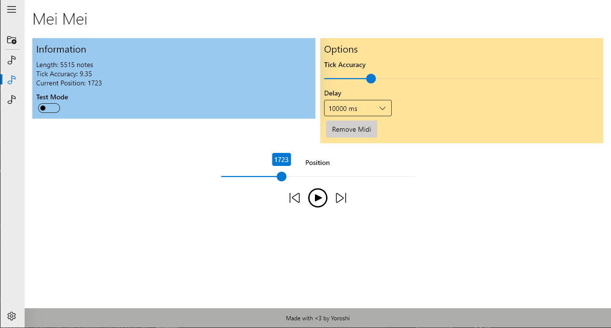
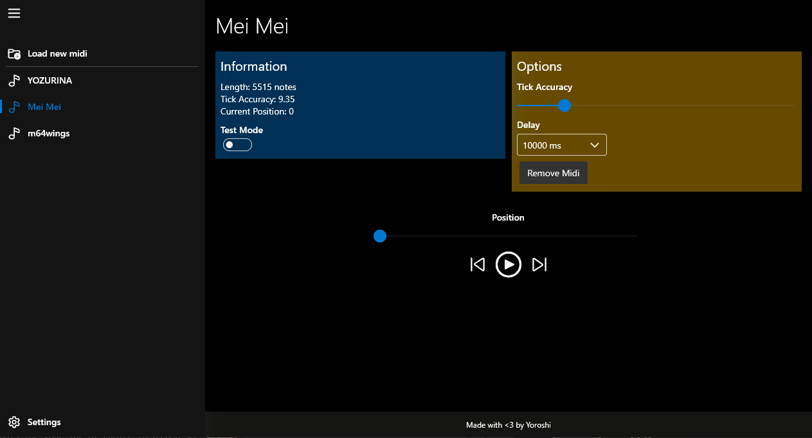

## Flutter Genshin Lyre Auto Player

A native flutter implementation of a midi to Genshin Lyre player.




## Features

- Native compiled program, no coding required!
- Windows Fluent UI for native windows experience
- Easy to use select your .mid to play
- Playback controls
- Easy editing of playback options

## How to use

1. Download the [latest release](https://github.com/yoroshikun/flutter_genshin_lyre_player/releases) from the releases tab (genshin_lyre.zip)
2. Run the program in administrator mode (this is required for input into genshin client)
3. Open the .mid file you would like to player (you can open multiple workspaces)
4. Adjust the settings as you prefer
5. Click play to start playback (please ensure you are in the genshin window when playback starts) (test mode will open notepad to test with)

## Find a bug?

Please raise an issue in the github issues so i can get to fixing it! or if you feel like it you can make a pull request with the fix.

## Contributing

This project was hastily written with flutter and dart, if you want to contribute your knowledge please do so! I am still very new to OOP and flutter and would love feedback and contributions from the community.

Translations is also something I am looking for, if you know other languages and would like to translate the project please reach out!

### Development setup

Fork and pull down this repo and follow the steps below :)

The flutter SDK is required and installation instructions are [here](https://flutter.dev/docs/get-started/install).

To develop in this repo with your own flutter setup you must first enable desktop compiling.

```bash
flutter config --enable-windows-desktop
```

> You can develop this app with other operating systems such as macosx and linux however many features require the windows API to work such as the file_picker and keypressing

It is highly recommended that you download the flutter dev tools for your IDE of choice to assist with developing

## Special Thanks

- Misaka17032 for the original inspiration and lyre auto play python script
- Dart_Midi package for native dart midi support
- Flutter [Fluent UI](https://github.com/bdlukaa/fluent_ui) by bdlukaa
- Flutter team, for making flutter!

## Post script

Please credit this source when you use this program for content creation (Youtube, Reddit, etc.).
This program is open source / freeware, please do not sell it.

Please leave a star on the project if you enjoyed using it!

## Troubleshooting

This program requires the Windows Visual C++ Redistributables to run. If for some reason you do not have it you can download it [Here](https://www.microsoft.com/en-au/download/details.aspx?id=48145)
